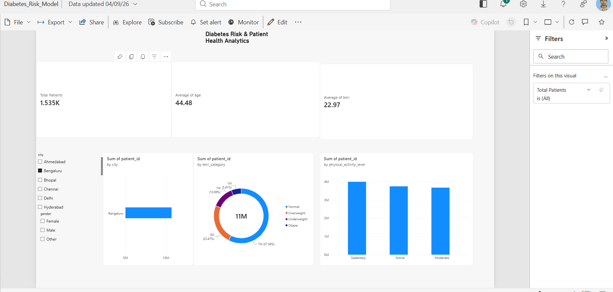

# 🏥 Diabetes Risk & Patient Health Analytics

An end-to-end Healthcare Data Analytics project built using **Microsoft Power BI** and **Power Query** to analyze patient demographics, lifestyle factors, clinical metrics, and their correlation with diabetes risk.

---

## 📊 Dashboard Preview (Work in Progress)



> **Status**: *Draft / Baseline MVP (Phase 1)* — Currently capturing primary patient KPIs, demographic filters, and Power Query feature transformations. Additional analytical charts and clinical risk factor breakdowns are in active development.

---

## 🎯 Business & Clinical Objectives
- **Early Risk Identification**: Analyze how lifestyle (physical activity, smoking, diet, sleep) and physiological markers (BMI, HbA1c, fasting blood sugar, blood pressure) correlate with diabetes risk levels.
- **Population Health Insights**: Identify geographical hotspots and high-risk demographic clusters across Indian metropolitan cities (Mumbai, Bengaluru, Delhi, Hyderabad, Chennai, Ahmedabad, Kolkata, etc.).
- **Data-Driven Intervention**: Provide healthcare stakeholders and clinicians with interactive slicing to evaluate risk distributions across gender, age brackets, and BMI categories.

---

## 📁 Repository Structure

```text
├── data/
│   └── diabetes_risk.csv            <-- Primary dataset containing 1,500+ patient records
├── images/
│   └── dashboard_preview.png        <-- Canvas preview of the Power BI dashboard
└── README.md                        <-- Project documentation & analytical notes
```

---

## 📋 Data Dictionary (Key Features)

| Feature | Type | Description |
| :--- | :--- | :--- |
| `patient_id` | Integer | Unique identifier for each patient |
| `age` | Integer | Patient age in years |
| `gender` | Text | Male, Female, Other |
| `city` | Text | Residential city (e.g., Mumbai, Bengaluru, Delhi, etc.) |
| `bmi` | Decimal | Body Mass Index ($kg/m^2$) |
| `family_history_diabetes` | Text | Yes / No genetic predisposition |
| `physical_activity_level` | Text | Sedentary, Moderate, Active |
| `diet_type` | Text | Vegetarian, Non-Vegetarian |
| `smoking_status` | Text | Never, Current, Former |
| `alcohol_consumption` | Text | Never, Occasional, Regular |
| `fasting_blood_sugar` | Integer | Blood glucose level after fasting ($mg/dL$) |
| `hba1c_level` | Decimal | Hemoglobin A1c percentage |
| `blood_pressure_systolic` | Integer | Systolic BP reading ($mmHg$) |
| `blood_pressure_diastolic`| Integer | Diastolic BP reading ($mmHg$) |
| `diabetes_risk` | Text | Target outcome classification (Low, Medium, High) |

---

## 🛠️ Data Cleaning & Feature Engineering (Power Query)
1. **Missing / Blank Value Imputation**:
   - Replaced blank and unrecorded values in `smoking_status` and `alcohol_consumption` with `"Unknown"` / `"Not Specified"` to avoid category loss.
2. **Clinical Feature Engineering (`bmi_category`)**:
   - Implemented standard WHO BMI categorization using Power Query M:
   ```powerquery
   if [bmi] <= 18.5 then "Underweight"
   else if [bmi] <= 24.9 then "Normal"
   else if [bmi] <= 29.9 then "Overweight"
   else "Obese"
   ```

---

## 📈 Planned Visualizations & Roadmap
- [x] Executive Summary KPI Cards (Total Patients, Average Age, Average BMI)
- [x] Multi-attribute Interactive Slicers (`city`, `gender`)
- [ ] BMI Category Distribution (Donut Chart)
- [ ] Diabetes Risk vs. Physical Activity Level (Clustered Column Chart)
- [ ] City-level Prevalence Breakdown (Clustered Bar Chart)
- [ ] Fasting Glucose & HbA1c Risk Correlation Matrix

---

## 👤 Author
- **GitHub**: [@Rajapakshaminindu](https://github.com/Rajapakshaminindu)
